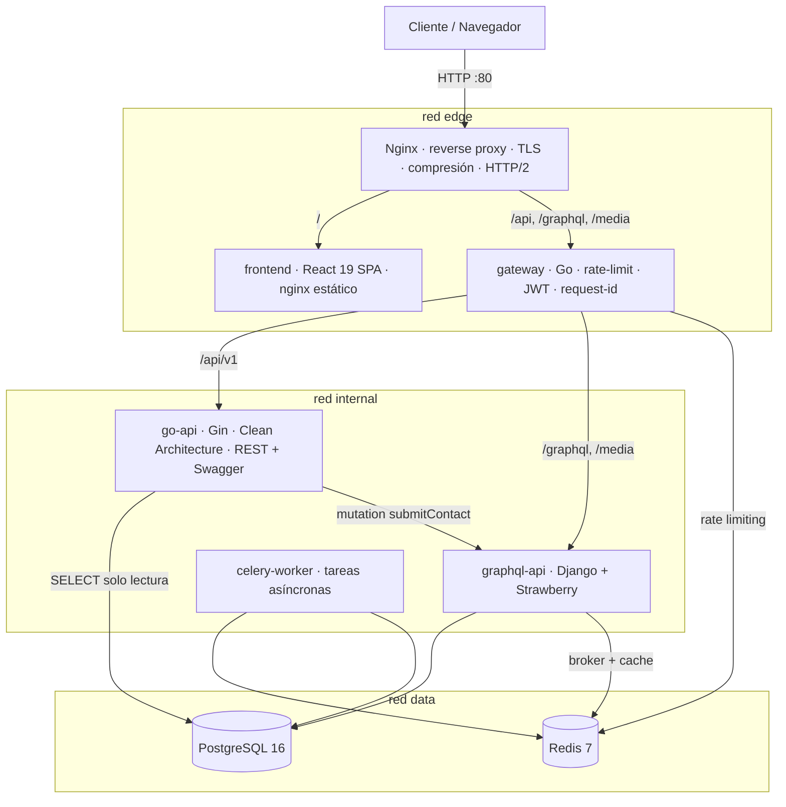

# Arquitectura

## Visión

Portafolio profesional implementado como sistema de microservicios cloud-native.
El objetivo no es solo *mostrar* proyectos: **el propio portafolio es la
demostración** de backend, sistemas distribuidos, DevOps y arquitectura limpia.

## Diagrama de contexto



## Flujo de una petición de contacto (integración entre servicios)

```
Cliente
  ↓  POST /api/v1/contact
Nginx                  — termina la conexión, comprime, propaga X-Request-ID
  ↓
Gateway (Go)           — rate limit por IP (Redis), CORS, logging estructurado
  ↓
Go REST API (Gin)      — validación (binding+dominio), caso de uso ContactSubmit
  ↓  mutation submitContact + X-Internal-Token
Django + Strawberry    — ReCaptcha (opcional), persistencia, encola Celery
  ↓
PostgreSQL             — INSERT contact_message (UUID, timestamps, auditoría)
  ↘
Celery worker          — notificación asíncrona (email stub / log)
```

Las lecturas (`GET /projects`, etc.) van Gateway → go-api → PostgreSQL
directamente (repositorios de solo lectura, CQRS a nivel de sistema: Django es
el *write side* del contenido, Go es un *read side* optimizado).

## Decisiones clave (resumen — detalle en `docs/adr/`)

| ADR  | Decisión |
|------|----------|
| 0001 | Microservicios con gateway propio en Go además de Nginx |
| 0002 | Frontend SPA servido por contenedor propio, no por el edge |
| 0003 | Django dueño único del esquema; Go solo lectura; contacto delegado |
| 0004 | JWT HS256 con secreto compartido validado en el gateway |
| 0005 | Rate limiting centralizado en el gateway con Redis |
| 0006 | Docker Compose como entorno canónico, diseño portable a Kubernetes |

## Clean Architecture (go-api)

```
backend-go/
├── cmd/api/            # main: composición (DI manual por constructor)
├── internal/
│   ├── domain/         # entidades + interfaces de repositorio (cero deps)
│   ├── usecase/        # casos de uso (dependen solo de domain)
│   ├── adapter/
│   │   ├── http/       # handlers Gin, DTOs, middleware
│   │   └── notifier/   # cliente GraphQL hacia Django (Adapter pattern)
│   └── infrastructure/ # postgres (pgx), config, logger
└── api/                # OpenAPI generado (swag)
```

La regla de dependencia apunta siempre hacia `domain`. Gin, pgx y el cliente
HTTP son detalles intercambiables detrás de interfaces.

## Hexagonal / puertos y adaptadores (graphql-api)

Django aporta ORM y admin; Strawberry expone el puerto GraphQL. La lógica de
negocio vive en `services/` (application layer), los resolvers son adaptadores
finos, DataLoaders eliminan N+1.

## Preparación para Kubernetes

- Cada servicio: imagen propia, stateless, config 100 % por entorno (12-factor).
- Health checks liveness/readiness ya expuestos → se mapean a probes.
- Redes de compose → NetworkPolicies; volúmenes → PVCs; `.env` → Secrets/ConfigMaps.
- Nginx edge → Ingress Controller; el gateway se conserva tal cual.

## Observabilidad

Logs JSON a stdout (recolectables por Loki/CloudWatch), `X-Request-ID`
propagado de extremo a extremo, métricas de latencia por request en logs del
gateway. Punto de extensión: OpenTelemetry (los middlewares ya centralizan el
lugar de instrumentación).
