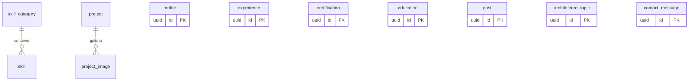

# Diseño de Base de Datos

PostgreSQL 16 · DB `portfolio` · Esquema gestionado por migraciones de Django (ADR-0003).
Extensiones: `pgcrypto` (gen_random_uuid). Creadas por `docker/postgres/init/01-extensions.sql`.

## Convenciones transversales

Toda tabla hereda de un modelo base abstracto:

| Columna      | Tipo          | Regla                                             |
|--------------|---------------|---------------------------------------------------|
| `id`         | `uuid`        | PK, `DEFAULT gen_random_uuid()`                   |
| `created_at` | `timestamptz` | `NOT NULL`, auto                                  |
| `updated_at` | `timestamptz` | `NOT NULL`, auto                                  |
| `deleted_at` | `timestamptz` | `NULL` ⇒ vivo. Soft delete: nunca `DELETE` físico |

- Managers de Django filtran `deleted_at IS NULL` por defecto.
- Índice parcial por tabla: `CREATE INDEX ... WHERE deleted_at IS NULL`.
- Auditoría: `updated_at` + logging estructurado de mutaciones (request_id).

## Tablas

### `profile` (singleton lógico)
`full_name`, `headline`, `bio` (text), `photo_url`, `cv_url`, `github_url`,
`linkedin_url`, `email`, `location`, `philosophy` (text).
Constraint: singleton garantizado por índice único sobre expresión constante.

### `skill_category`
`name` (unique), `slug` (unique), `display_order` (int).

### `skill`
`category_id` FK→skill_category (ON DELETE RESTRICT), `name`, `icon` (slug de
icono, ej. `simple-icons:go`), `level` (smallint, `CHECK level BETWEEN 1 AND 5`),
`years` (numeric(4,1), `CHECK years >= 0`), `description`, `display_order`.
Índice: `(category_id, display_order)`.

### `project`
`slug` (unique), `title`, `summary`, `description` (text/markdown), `problem`,
`solution`, `outcome`, `stack` (jsonb, array de strings), `image_url`,
`architecture_diagram_url`, `github_url`, `demo_url`, `video_url`,
`featured` (bool, default false), `display_order`.
Índices: `slug` unique, parcial `featured WHERE featured AND deleted_at IS NULL`.

### `project_image`
`project_id` FK→project (ON DELETE CASCADE), `url`, `caption`, `display_order`.

### `experience`
`company`, `role`, `location`, `start_date` (date), `end_date` (date NULL ⇒ actual),
`description`, `achievements` (jsonb array), `tech` (jsonb array), `display_order`.
Constraint: `CHECK (end_date IS NULL OR end_date >= start_date)`.

### `certification`
`name`, `issuer`, `issue_date`, `expires_at` (NULL), `credential_id`,
`credential_url`, `badge_url`.

### `education`
`institution`, `degree`, `field`, `start_date`, `end_date` (NULL), `description`.
Constraint fechas igual que `experience`.

### `post`
`slug` (unique), `title`, `excerpt`, `content` (markdown), `cover_url`,
`tags` (jsonb array), `published` (bool), `published_at` (timestamptz NULL),
`reading_minutes` (smallint).
Índices: `slug` unique, parcial `(published_at DESC) WHERE published AND deleted_at IS NULL`,
GIN sobre `tags`.

### `architecture_topic`
`slug` (unique), `title`, `category` (ej. `patterns`, `infra`, `observability`),
`description` (markdown), `diagram_url`, `display_order`.

### `contact_message`
`name`, `email`, `subject`, `message`, `ip_address` (inet NULL),
`user_agent`, `status` (`new` | `read` | `replied`, CHECK).
Índice: `(status, created_at DESC)`.

## Diagrama ER

Las tablas sin FK son agregados independientes (DDD: cada una es su propio
aggregate root; la relación skill_category→skill y project→project_image son
las únicas composiciones).

## Acceso por servicio

| Servicio    | Acceso                                                        |
|-------------|---------------------------------------------------------------|
| graphql-api | Lectura/escritura total (dueño del esquema)                   |
| celery      | Lectura (`contact_message`) para notificaciones               |
| go-api      | **Solo lectura** de todas las tablas + ninguna escritura (el contacto se delega a Django, ver CONTRACTS §6) |

Un único escritor por tabla elimina conflictos de ownership de esquema y hace
trivial el razonamiento sobre consistencia.
